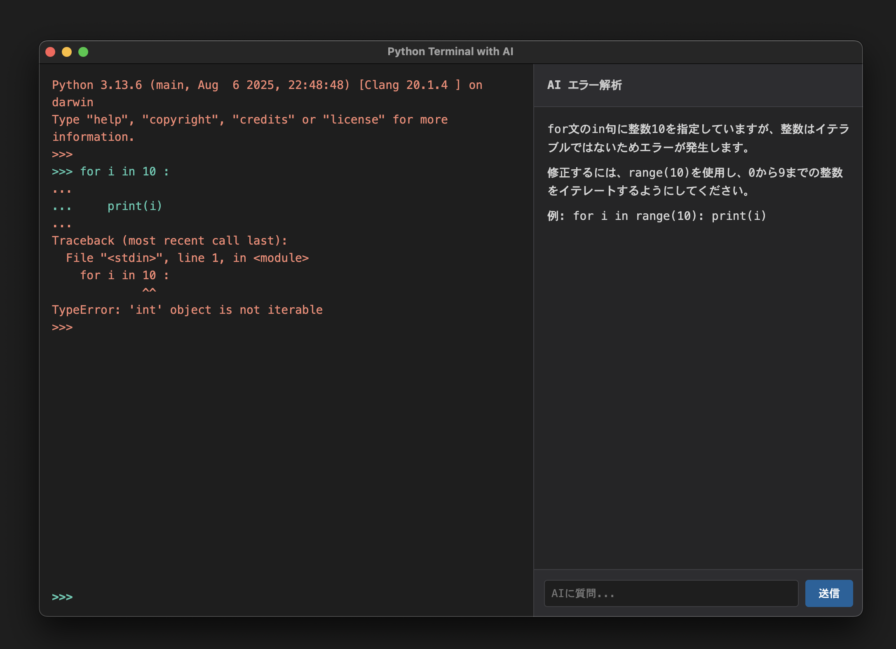

# PyTerm - AI対応Pythonターミナル

Python学習・実験用のインタラクティブターミナルアプリケーション。



## 特徴

- **内蔵Python環境**: Python 3.13.6 + numpyを同梱、システムへのインストール不要
- **AIエラー解析**: エラー発生時に自動で原因分析と修正方法を提示（xAI Grok使用）
- **AI対話機能**: Pythonコードに関する質問をAIに直接問い合わせ可能、対話履歴を保持
- **標準Python対話環境**: 通常のPython3インタプリタと同じ動作
- **マルチライン入力対応**: 関数定義・ループなどの複数行コードに対応
- **コードペースト機能**: インデント付きコードをそのままペースト可能

## 技術スタック

- **フロントエンド**: Electron + TypeScript
- **Python**: スタンドアローンビルド（python-build-standalone）
- **AI**: xAI Grok API (grok-code-fast-1)
- **セキュリティ**: macOSキーチェーンによるAPIキー管理

## 使い方

### 開発環境での実行

```bash
# 依存関係のインストール（初回のみ、Pythonも自動ダウンロード）
npm install

# アプリケーションの起動
npm start
```

### リリースビルド

```bash
# macOS用.appファイルの生成（署名なし・高速）
npm run pack

# 署名付きビルド（配布用）
npm run pack-signed

# 生成されたアプリ: release/mac-arm64/PyTerm.app
```

**注意**: `pack-signed`は開発用証明書で署名するため時間がかかります。開発中は`pack`を使用してください。

### 初回起動時

1. アプリを起動すると、APIキー入力画面が表示されます
2. xAI APIキーを入力して保存
3. キーはmacOSキーチェーンに暗号化保存されます

### Python実行

- 通常のPython対話環境として使用
- `>>>` プロンプトでコードを入力
- 複数行入力時は `...` プロンプトに変わり、空行で実行
- エラー発生時は右側のパネルにAI解析結果を表示

### AI質問機能

- 右側パネルの入力欄にPythonに関する質問を入力
- 「送信」ボタンで質問を送信
- 対話履歴が保持され、継続的な会話が可能

## システム要件

- macOS (Apple Silicon)
- xAI APIキー

## セキュリティ

- APIキーはmacOSキーチェーンに暗号化保存
- `security`コマンドで確認可能:
  ```bash
  security find-generic-password -s "PyTerm" -a "xai-api-key"
  ```

## プロジェクト構成

```
pyterm/
├── src/
│   ├── main.ts          # Electronメインプロセス
│   ├── preload.ts       # プリロードスクリプト
│   ├── renderer.ts      # レンダラープロセス
│   └── global.d.ts      # TypeScript型定義
├── scripts/
│   ├── download-python.sh    # Python自動ダウンロード
│   └── install-packages.sh   # numpyインストール
├── resources/
│   └── python/          # 内蔵Python環境（自動生成）
├── index.html           # UI
└── package.json
```

## ライセンス

MIT